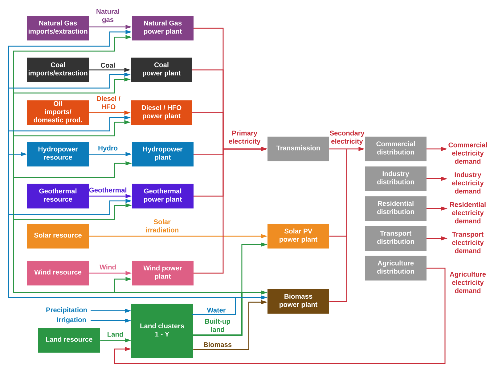

# Model structure

This section details the structure of the integrated CLEWS-Ethiopia model. 
It is divided into 3 sub-sections: energy, land-use, and water. Each sub-section provides
a snapshot of the underlying representation of the relevant sector in the CLEWS model. 

## Energy

Population

{{ read_csv('tables/population.csv') }}

